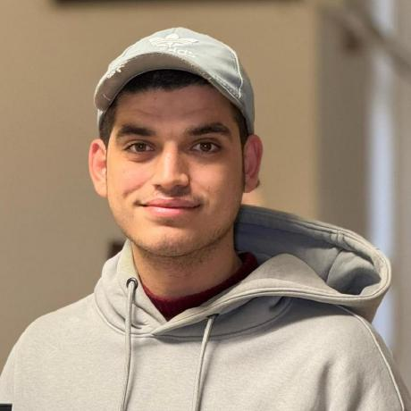

<!-- 🔥 BANNER -->

  

<!-- PROFILE HEADER -->

  <h1 style="font-size: 3rem; margin-bottom: 10px; background: linear-gradient(45deg, #8B5CF6, #A78BFA); -webkit-background-clip: text; -webkit-text-fill-color: transparent; font-weight: bold;">
    👋 Hi, I'm Ahmed Moatz
  </h1>
  <h3 style="font-size: 1.5rem; color: #A78BFA; margin-bottom: 20px; font-weight: 300;">
    🎓 Front-End Developer | Tech Enthusiast
  </h3>
  
  

---

## 🧠 About Me

  
- 🧑‍🎓 Recent graduate from **Faculty of Computers and Artificial Intelligence – Benha University**
- 💻 Skilled in **React.js**, **Tailwind CSS**, **HTML**, **CSS**, **JavaScript**
- 🌱 Passionate about learning **Next.js** and advanced front-end patterns
- ⚡ Strong problem-solving and UI/UX design skills

---

## 📇 Contact Information

  <a href="https://www.linkedin.com/in/ahmed-moatz-a81b4a352" style="display: inline-block; margin: 5px; padding: 12px 20px; background: linear-gradient(45deg, #8B5CF6, #7C3AED); color: white; text-decoration: none; border-radius: 25px; font-weight: 600; transition: all 0.3s ease;">
    LinkedIn
  </a>
  <a href="https://github.com/ahmedmoatz" style="display: inline-block; margin: 5px; padding: 12px 20px; background: linear-gradient(45deg, #8B5CF6, #7C3AED); color: white; text-decoration: none; border-radius: 25px; font-weight: 600; transition: all 0.3s ease;">
    GitHub
  </a>
  <a href="mailto:moatz0742@gmail.com" style="display: inline-block; margin: 5px; padding: 12px 20px; background: linear-gradient(45deg, #8B5CF6, #7C3AED); color: white; text-decoration: none; border-radius: 25px; font-weight: 600; transition: all 0.3s ease;">
    Email
  </a>
  <a href="tel:+201013818318" style="display: inline-block; margin: 5px; padding: 12px 20px; background: linear-gradient(45deg, #8B5CF6, #7C3AED); color: white; text-decoration: none; border-radius: 25px; font-weight: 600; transition: all 0.3s ease;">
    Phone
  </a>

- **📱 LinkedIn:** [linkedin.com/in/ahmed-moatz-a81b4a352](https://www.linkedin.com/in/ahmed-moatz-a81b4a352)  
- **💻 GitHub:** [github.com/ahmedmoatz](https://github.com/ahmedmoatz)  
- **📧 Email:** moatz0742@gmail.com  
- **📞 Phone:** +20 1013818318  
- **📍 Address:** Estanha - El-Bagour Center - Menoufia Governorate  
- **🎂 Birthday:** May 15

---

## 🔧 Tech Stack & Tools

  

    HTML5
  

  

    CSS3
  

  

    JavaScript
  

  

    React
  

  

    Tailwind
  

  

    Git
  

  

    GitHub
  

  

    VS Code
  

---

<!-- FOOTER -->

<h3 style="color: white; font-size: 1.5rem; margin-bottom: 20px; position: relative; z-index: 2;">
  Let's Build Something Amazing Together! 🚀
</h3>

  Thank you for visiting my profile! Feel free to reach out for collaborations or just to say hello! 👋

 

  <strong>© 2024 Ahmed Moatz - Crafted with 💜 and Black</strong>

