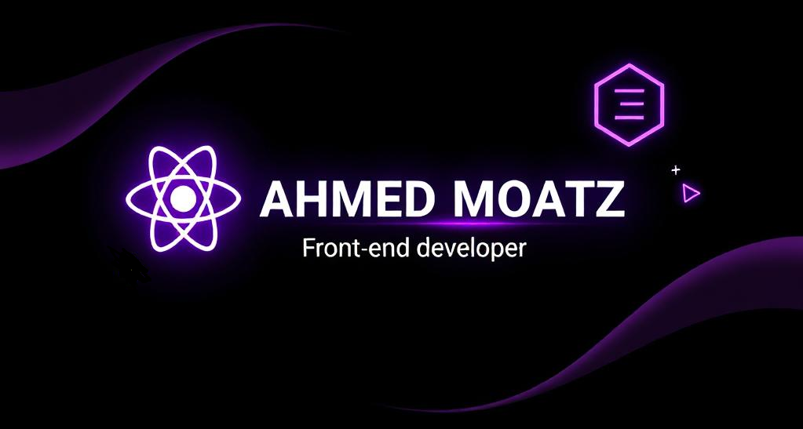

<!-- 🔥 BANNER -->

  

  

<!-- PROFILE HEADER -->
<h1 align="center" style="font-size: 40px;">👋 Hey, I'm Ahmed Moatz</h1>
<h3 align="center">🎓 Front-End Developer | Tech Explorer</h3>

<!-- MAIN TYPING EFFECT -->

  

    
    

<!-- 👨‍💻 About -->
<h2 align="center">👨‍💻 About Me</h2>

✨ Passionate Front-End Developer who loves building interactive and modern UIs using <b>React</b>. 
💜 Focused on performance, accessibility, and great user experiences. 
📚 Always learning new technologies to stay ahead. 
🌍 Based in Egypt | Open for collaboration.

---

## 🧰 Tech Stack & Tools

  

---

## 📈 GitHub Stats

  
  

  

---
## Contact Me

  <!-- Email -->
  
  
  <!-- LinkedIn -->
  
  
  <!-- Facebook -->
  
  
  <!-- WhatsApp -->
  
  

  
---

<!-- FOOTER -->

  

